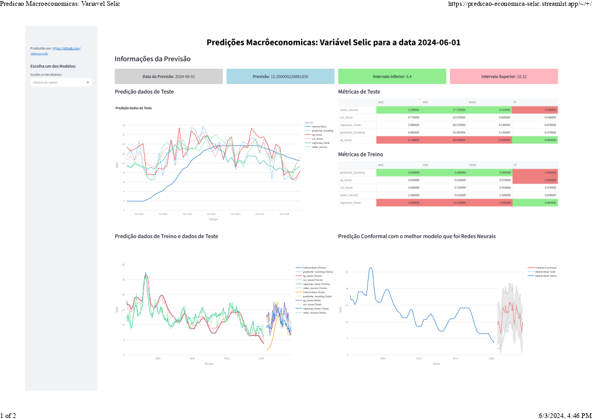

# Previsões Macroeconômicas da Economia Brasileira

<video width="700" height="400" controls>
    <source src="imagens/steamlit_app.webm" type="video/webm">   
</video>
    

## Introdução

Este é um projeto de análise e previsões macroeconômicas focado na economia do Brasil. Nosso objetivo é utilizar dados históricos e modelos de aprendizado de máquina para entender tendências passadas e fazer previsões sobre indicadores macroeconômicos importantes, como o Produto Interno Bruto (PIB), taxa de inflação, taxa de desemprego e outros.

## Motivação

A economia brasileira é altamente dinâmica e influenciada por uma variedade de fatores, incluindo mudanças nas políticas governamentais, flutuações nos preços das commodities, oscilações cambiais e muito mais. Prever com precisão esses indicadores é crucial para investidores, tomadores de decisão políticos e empresas que desejam se adaptar às condições econômicas em constante mudança.

## Dados Utilizados

Nossas análises se baseiam em uma ampla gama de dados macroeconômicos de fontes confiáveis:
- **Instituto Brasileiro de Geografia e Estatística (IBGE)**
- **Banco Central do Brasil**
- **Fundação Getúlio Vargas (FGV)**
- **Outras fontes confiáveis**

Esses dados abrangem décadas de informações sobre variáveis econômicas cruciais.

## Metodologia

Utilizamos técnicas avançadas de análise de séries temporais e aprendizado de máquina para construir modelos que possam capturar padrões históricos e fornecer previsões confiáveis. Nossos modelos são ajustados regularmente para refletir as últimas informações econômicas e ajustes nas condições do mercado.

## Resultados

Este repositório contém os resultados de nossas previsões macroeconômicas, incluindo:
- **Gráficos**
- **Análises estatísticas**
- **Relatórios detalhados sobre nossos modelos**

Atualizamos regularmente as previsões à medida que novos dados são lançados.

## Como Contribuir

Convidamos você a contribuir para este projeto. Se você é um especialista em economia, cientista de dados ou apenas está interessado em análise econômica, sua contribuição é valiosa. Você pode ajudar a:
- **Melhorar nossos modelos**
- **Adicionar novas fontes de dados**
- **Corrigir erros**
- **Propor novas análises**

---

Explore nosso trabalho e participe dessa iniciativa para melhor compreender a economia brasileira!

